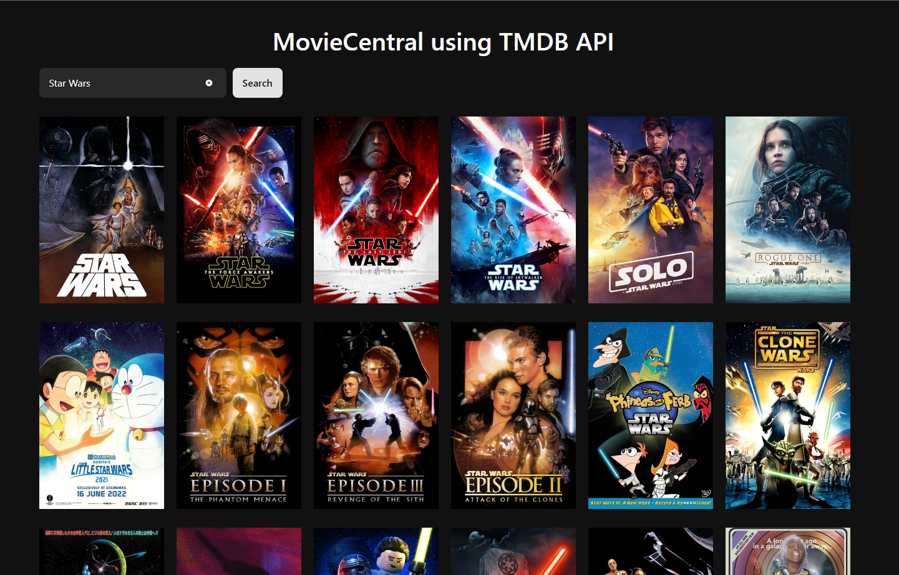
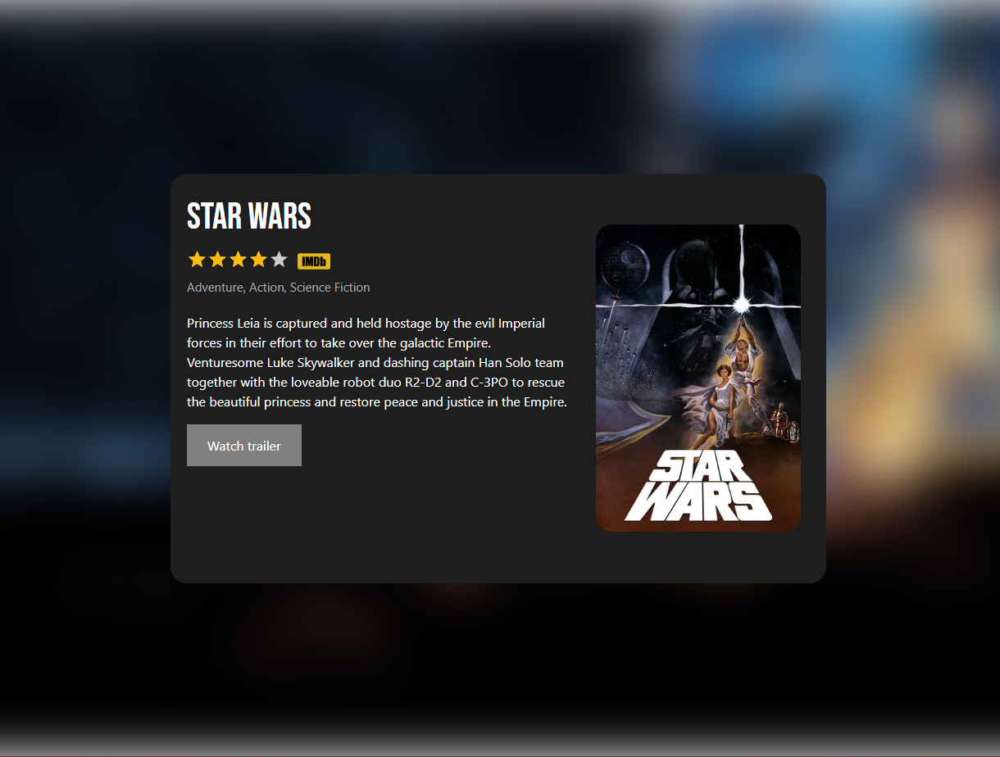

# MovieCentral using TMDb API Project


This project is a movie website built using React, TypeScript, and several libraries and technologies. It utilizes the free movie API from The Movie Database (TMDb).

## Technologies and Libraries Used

### React Router

- **Purpose**: React Router is used to create a multi-page experience within a single-page React application. It allows for navigation between different views and URLs.
- **Components**: 
  - `HomeView` (Smart): Serves as the main view of the application, handling the display of movie cards and search functionality.
  - `MovieDetailView` (Smart): Responsible for displaying detailed information about a selected movie.

### Styled Components

- **Purpose**: Styled Components is utilized for styling React components. It enables the creation of reusable, encapsulated, and styled components with CSS-in-JS.
- **Components**: 
  - Various styled components are used throughout the application to create visually appealing UI elements, including movie cards and detail views.

### Base Web

- **Purpose**: Base Web provides a design system and component library for building consistent and accessible user interfaces. It is used to enhance the visual design and structure of the website.
- **Components**:
  - Base Web components are used for styling and structuring parts of the user interface, ensuring a cohesive and user-friendly look and feel.

### Axios

- **Purpose**: Axios is a HTTP client used for API requests. It eases communication with the TMDb API to fetch movie data for display.
- **Components**:
  - API service functions are used to interact with the TMDb API, providing data to components such as `HomeView` and `MovieDetailView`.

## Project Structure

### Components

The project follows a component-based architecture, categorizing components into different types:

- **Smart Components**: These components manage data and logic, including API requests and state management. They serve as the brains of the application, orchestrating data flow.
  - `HomeView` (Smart): Handles movie data retrieval and search functionality.
  - `MovieDetailView` (Smart): Manages the fetching of movie details by ID and renders the detailed view.

- **Pure Components**: These components are purely presentational and stateless. They focus on rendering UI elements with minimal logic.
  - Various styled components fall into this category, responsible for rendering styled UI elements.
  - `MovieCard` (Pure): Displays individual movie information, such as title and rating.

## API

The project fetches movie data from the TMDb API, which provides extensive information about movies, including details, genres, posters, and more. You can learn more about the TMDb API [here](https://developer.themoviedb.org/reference/intro/getting-started).

## Getting Started

To get started with this project, follow these steps:

1. Clone the project repository to your local machine:

   ```shell
   git clone https://gitlab.com/henriqueleote/tb-interview-task-frontend-leote.git
   ```
2. Navigate to the project folder:
```shell
   cd your-project-given-name
   ```
3. Install project dependencies using npm or yarn:
   ```shell
   npm install
   # OR
   yarn install
   ```
4. Start the development server:
   ```shell
   npm run dev
   # OR
   yarn dev
   ```

## Project Screenshots

Here are some screenshots from the movie website:


*Caption: The Home Page displaying a list of movies.*


*Caption: The Movie Detail Page showing detailed information about a selected movie.*
